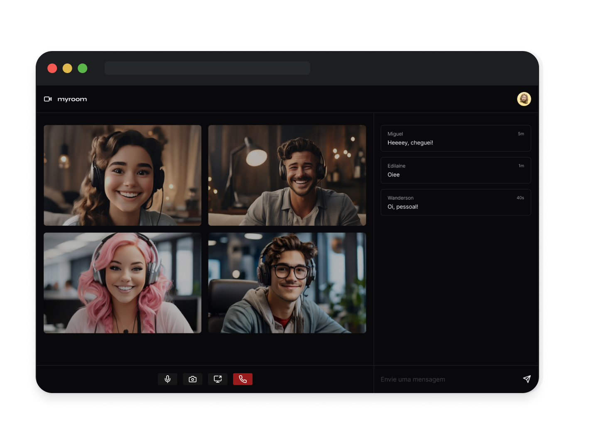

# myroom

> 🔥 Comunicação em Tempo Real com a API WebRTC

<div align="center">
  
</div>

## Sumário

- [Pré-requisitos](#pré-requisitos)
- [Introdução](#introdução)
- [Começando](#começando)
  - [Clonando o Repositório](#clonando-o-repositório)
  - [Instalando as Dependências](#instalando-as-dependências)
  - [Configurando as Variáveis de Ambiente](#configurando-as-variáveis-de-ambiente)
  - [Executando o Projeto](#executando-o-projeto)
- [Referências](#referências)
- [Problemas](#problemas)
- [Contribuindo](#contribuindo)
- [Licença](#licença)
- [Autor](#autor)

## Pré-requisitos

- Git
- NodeJS

## Introdução

Este aplicativo tem como objetivo permitir que pessoas se comuniquem em tempo real por meio de vídeo, áudio e mensagens.

As principais tecnologias utilizadas para o seu desenvolvimento são a API [WebRTC](https://webrtc.org/?hl=pt-br) para comunicação de pares e o [socket.io](https://socket.io/) para compartilhamento de informações em tempo real.

## Começando

Siga estes passos para configurar e executar o projeto localmente:

### Clonando o Repositório

Clone o repositório:

```shell
git clone git@github.com:wandersonalwes/myroom.git
```

### Instalando as Dependências

Navegue até o diretório `frontend`:

```shell
cd frontend
```

Instale as dependências do frontend:

```shell
npm install
```

Navegue até o diretório `backend`:

```shell
cd backend
```

Instale as dependências do backend:

```shell
npm install
```

### Configurando as Variáveis de Ambiente

No diretório `frontend`, copie o arquivo de exemplo `.env.example` para um arquivo `.env.local`:

```shell
cp .env.example .env.local
```

No diretório backend, também copie o arquivo de exemplo `.env.example` para um arquivo `.env`:

```sh
cd ../backend
cp .env.example .env
```

Abra os arquivos `.env` em ambos os diretórios e altere as variáveis de ambiente conforme necessário para o seu ambiente local.

### Executando o Projeto

No diretório frontend, execute o frontend:

```shell
npm run dev
```

No diretório backend, execute o backend:

```shell
npm run dev
```

Agora o projeto deve estar em execução localmente. Certifique-se de configurar corretamente as variáveis de ambiente para evitar problemas de execução.

## Referências

Para uma compreensão mais aprofundada sobre o funcionamento da API WebRTC, recomendo explorar a documentação oficial do [MDN Web Docs](https://developer.mozilla.org/pt-BR/docs/Web/API/WebRTC_API). Lá, encontrará uma variedade de recursos, exemplos práticos e explicações detalhadas que me ajudaram a entender e utilizar efetivamente a WebRTC em meu desenvolvimento.

## Problemas

Sinta-se à vontade para registrar uma nova issue com o respectivo título e descrição no repositório [myroom](https://github.com/wandersonalwes/myroom/issues). Se você já encontrou uma solução para o seu problema, adoraria revisar sua solicitação de pull! Dê uma olhada em nossas [diretrizes de contribuição](./CONTRIBUTING.md) para saber mais sobre os padrões de codificação.

## Contribuindo

Verifique a página de [contribuição](./CONTRIBUTING.md) para ver os melhores lugares para registrar problemas, iniciar discussões e começar a contribuir.

## Licença

Esse projeto está sob a licença MIT. Veja o arquivo [LICENSE](./LICENSE) para mais detalhes.

## Autor

<table>
  <tr>
    <td align="center">
      <a href="https://github.com/wandersonalwes">
        <br>
        <sub>
          <b>Wanderson Alves</b>
        </sub>
      </a>
    </td>
  </tr>
</table>

---

Se você gostou deste projeto, ficaria muito agradecido se pudesse deixar uma ⭐ no repositório e compartilhá-lo com seus amigos!
